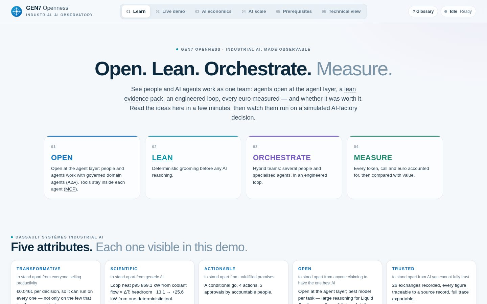
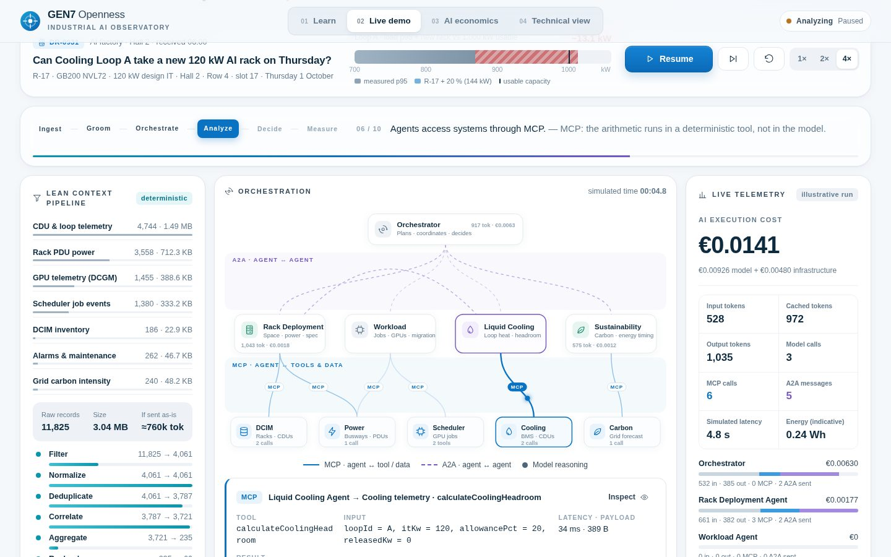
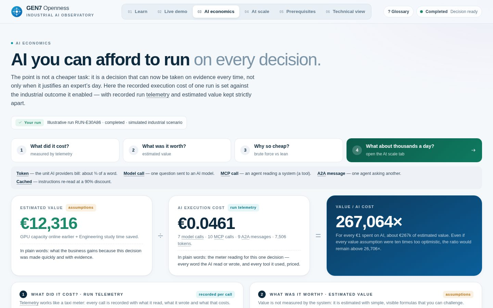
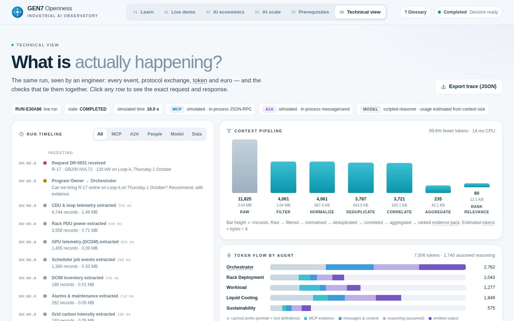

# GEN7 Openness · Industrial AI observatory

An executive-quality, engineer-inspectable demonstrator of four ideas:

**OPEN → LEAN → ORCHESTRATE → MEASURE**

1. **Open at the agent layer** — people and other agents work with governed domain agents through **A2A** (goal in, verified answer out). **MCP** stays inside each agent, as the way it reaches its own systems — not the open interface (opening raw tools pushes callers into brute-force attempts).
2. **Hybrid teams in an engineered loop** — several people (Program Owner, Cluster Ops Lead, Facility Manager) coordinate, approve and sign off alongside specialised agents; the long-running job is an explicit loop with a goal, a deterministic acceptance test, a correction step, a budget and a stop rule (*loop engineering*; graph engineering is the next step).
3. **Lean AI** — deterministic grooming of plant data *before* any AI reasoning.
4. **AI economics** — the recorded execution cost of a run, compared with the estimated value it enabled, and a three-step explanation of the brute-force vs lean saving.
5. **At scale** — a projection of per-decision savings across sites and volumes, and why telemetry matters.
6. **Dassault Systèmes Industrial AI framing** — the five attributes (Transformative, Scientific, Actionable, Open, Trusted), the Virtual Companions (each agent is a Competence of AURA or LEO; each MCP tool call is a Skill), the three Industry World Models pillars, and a **Prerequisites** tab showing each pillar with and without the platform on the demo's own numbers. Wording comes from internal program material in `src/domain/positioning.js` — **keep this repository private**.

| Learn | Live demo |
| --- | --- |
|  |  |
| **AI economics** | **Technical view** |
|  |  |

## Run it

Node.js 22+. No dependencies, no API key.

```bash
npm start            # http://127.0.0.1:3000
npm test             # engine, grooming, invariants, protocols, server
npm run build        # static site in dist/ (GitHub Pages workflow included)
```

ES modules do not load from `file://`; always serve over HTTP.

## The scenario (simulated)

AI factory, Hall 2. Deployment request **DR-0931**: install **R-17**, a GB200 NVL72-class rack (**120 kW** design IT), on **Cooling Loop A** (1,000 kW usable) on Thursday. The planning rule adds a 20 % allowance, so the target is 144 kW against the loop's measured p95 heat.

Four specialists and an orchestrator decide: Rack Deployment (DCIM, power), Liquid Cooling (BMS), Workload (scheduler, power) and Sustainability (grid carbon).

Outcome of the reference run: Loop A p95 heat is 869 kW, computed from CDU flow × ΔT during grooming → **13 kW short** as-is. Cooling asks Workload to release load; Workload proposes moving low-priority, checkpointable `ft-sweep-17` from A-07 to idle B-05 (38.7 kW). Cooling re-runs the same deterministic check → **+25.6 kW**. Decision: deploy on Thursday, conditional on the migration; burn-in 01:00–07:00 at the lowest grid carbon intensity.

A 12-minute presenter script is in [PRESENTER.md](PRESENTER.md).

## What is real, what is simulated

**Actually computed on every run**

- A seeded synthetic dataset (~11.8k raw records, ~3 MB, 7 sources with °F/°C, gpm/L/min, W/kW, three time formats and mirror duplicates) is generated.
- The six grooming stages (filter, normalise, deduplicate, correlate, aggregate, rank) really execute; record counts, bytes and CPU time are measured.
- MCP tools are deterministic handlers over the groomed evidence pack, called through JSON-RPC 2.0 `tools/list` / `tools/call` envelopes. Payload sizes are measured from the responses.
- A2A messages are `message/send` envelopes with one sentence plus a data part, bounded to 200 tokens.
- Every figure (tokens, cost, latency, brute-force-vs-lean, value, value/cost) is derived from one run model; ten consistency checks are shown in the Technical view.

**Simulated or assumed (labelled in the UI)**

- Agent reasoning is scripted (deterministic reasoners), not an LLM. Token usage is estimated from the actual context each agent receives (≈ 4 bytes/token) plus an assumed reasoning budget.
- Model prices, latency profiles, infrastructure unit costs, energy factors, system latencies and business-value assumptions are illustrative. Business value is **estimated**, never presented as measured.

## Architecture

```
src/
  domain/models.js            Run states, pillars, JSDoc domain types (Scenario, Agent, Tool, MCPCall, A2AMessage, …)
  scenarios/ai-factory/
    dataset.js                Seeded raw telemetry generator (CDUs, PDUs, GPUs, scheduler, DCIM, CMMS, grid)
    pipeline.js               Lean context pipeline (6 deterministic stages, heat = flow × ρ × cp × ΔT)
    tools.js                  MCP servers: DCIM, Power, Scheduler, Cooling (BMS), Carbon
    agents.js                 Agents, system prompts, scripted reasoners
    scenario.js               Request, run script, pricing/value assumptions
  adapters/                   mcp.js · a2a.js · model.js — replaceable transports
  engine/
    engine.js                 DemoEngine: single state machine and clock (start, pause, step, reset, 1×/2×/4×)
    telemetry.js              Metrics, brute-force comparison, receipts, business value, invariants
  ui/                         learn · demo · economics · scale · technical (render engine.run only)
styles/app.css                Design system
```

To connect real systems: pass an `mcpTransport` that POSTs the same JSON-RPC requests to an MCP server, an `a2aTransport` that resolves Agent Cards and POSTs `message/send`, and a `model` adapter returning provider usage — the engine, telemetry and UI are unchanged.

## Decision Intelligence (branch `decision-intelligence`)

**OBSERVE → GROOM → DECIDE → REASON → ACT → MEASURE.** A small decision model (System 1) now sits between grooming and the agents. It answers four bounded questions in under a millisecond, in the browser, and a confidence gate decides whether agents (System 2) are needed at all.

- **Runs entirely from GitHub Pages.** No server, no Ollama, no API key, no install. Preview: `https://opedoussaut.github.io/gen7-openness/decision-intelligence/` (the stable site at the root is unchanged).
- **The model** — `models/system1/decision-mlp.onnx` (8.5 KB, 1,772 parameters; MLP 9 → 32 → 32 → 12, four heads). Trained by `models/system1/train.py` (numpy, seed 7, reproducible byte for byte) on 9,000 synthetic samples labelled by planning rules; holdout accuracy in `model-card.json`. Inputs are nine deterministic features of the groomed evidence (`src/system1/features.js`).
- **Typed outputs** — `capacity_risk` LOW/MEDIUM/HIGH · `reasoning_required` YES/NO · `preferred_route` DIRECT/ORCHESTRATE/HUMAN_REVIEW · `agents_required` ⊆ {WORKLOAD, COOLING, SUSTAINABILITY, DEPLOYMENT}, each with probabilities.
- **Runtime** — ONNX Runtime Web 1.22.0, vendored in `vendor/` (MIT). WebGPU when the browser has an adapter, otherwise WASM (CPU, single-threaded because Pages is not cross-origin isolated), otherwise a pure-JavaScript evaluator of the same weights — clearly labelled as a fallback. The Technical view shows what actually executed: runtime, load/cold/warm timings, parity with the JS evaluator, network call *None*, API cost *€0*.
- **Gate** — act directly only if route = DIRECT, reasoning = NO and every confidence ≥ 75 %; otherwise System 2, or a person when the route is HUMAN_REVIEW.
- **Two requests** — **R-17** (complex, 120 kW NVL72 on Loop A): HIGH / YES / ORCHESTRATE / all four agents → System 2 runs as before. **R-22** (simple, 34 kW DGX on Loop B): LOW / NO / DIRECT → one bounded, reversible MCP action (`reserveRackSlot`), owner notified, **0 model calls**. Avoided reasoning is shown as an ESTIMATE against the R-17 run.
- **Cinematic** — `media/GEN7-cinematic-intro-system1-system2.mp4` (52.5 s; source `media/scene-system1-system2.html`, renderer `media/render-system1-system2.py`). The original 37-second film is kept unchanged; both are selectable in the Story tab.

Retrain: `cd models/system1 && python3 train.py` (numpy, onnx). Tests: `npm test` (includes ONNX hash, JS-vs-ONNX golden parity, holdout accuracy, R-17 escalation, R-22 bounded path).

## Protocol Lab (previous workshop, preserved)

`lab.html` keeps the original two-tab cooling-capacity workshop (Rack Deployment Planner ↔ Liquid Cooling Engineer) with live JSON-RPC over HTTP when served by `npm start`. It is linked from the page footer. Presenter script: [PROTOCOL-LAB-PRESENTER.md](PROTOCOL-LAB-PRESENTER.md).

This is a demonstrator, not a claim about deployed customer systems, and not an official 3DS product.

Protocol references: [MCP specification](https://modelcontextprotocol.io/specification/2025-11-25) · [A2A specification](https://a2a-protocol.org/v0.3.0/specification/).
