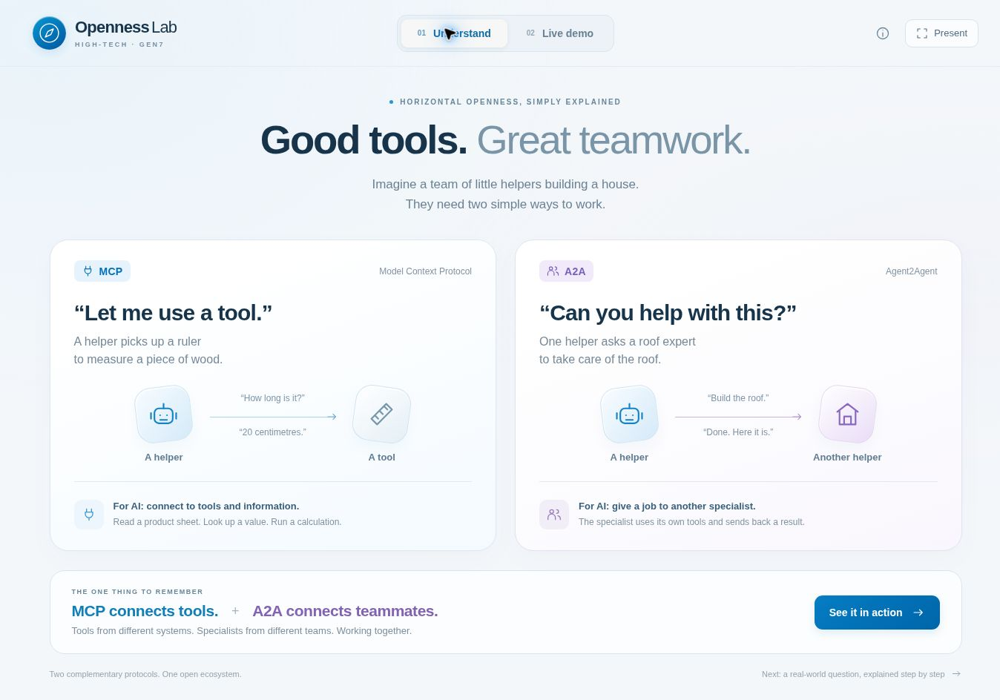
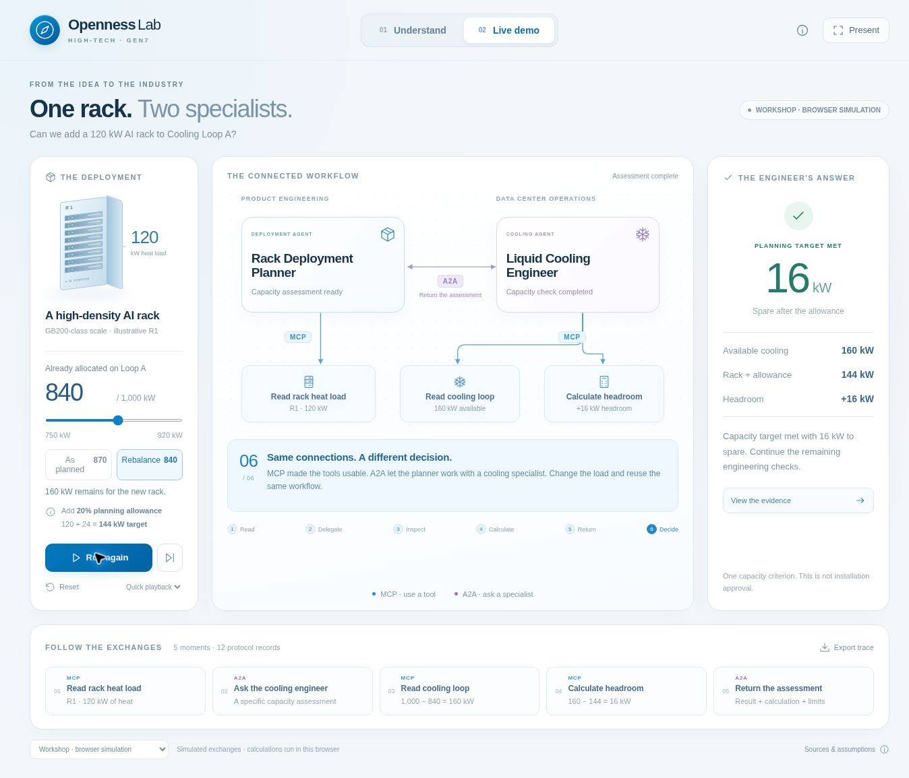

# GEN7 · Openness Lab

A two-tab workshop experience for **horizontal openness**: understand MCP and A2A, then watch two specific specialists work together.

- **Understand:** MCP is a helper using a tool. A2A is a helper asking another helper to do a job.
- **Live demo:** a Rack Deployment Planner asks a Liquid Cooling Engineer whether a cooling loop can take a new AI rack.
- Restrained blue industrial styling, soft surfaces, a rack illustration and animated protocol connections.
- Pause, step, replay, inspect every exchange, export the trace, and use presentation mode.





## Run the live HTTP version

Install **Node.js 22 or later**, then:

```bash
git clone https://github.com/opedoussaut/gen7-openness.git
cd gen7-openness
npm start
```

Open **http://127.0.0.1:3000**. There are **no npm dependencies to install and no API key**. The interface detects the local server and selects live HTTP mode. If another app uses port 3000, set the `PORT` environment variable before starting.

In GitHub Codespaces, use `HOST=0.0.0.0 npm start` and open the forwarded port 3000. Keep the port private. The agents and tools run together in one Node process; their protocol messages travel over HTTP.

## Run from GitHub Pages

The included workflow builds and publishes the **workshop browser simulation**. GitHub Pages is static hosting, so it cannot run the Node HTTP endpoints.

For the first publication, open this repository's **Settings → Pages → Build and deployment → Source**, and select **GitHub Actions**. Then run or rerun **Verify and publish workshop** in the Actions tab. GitHub displays the resulting Pages URL after deployment. Subsequent pushes to `main` republish it.

The static page clearly labels simulated exchanges. Calculations still execute live in the browser. It uses local assets and relative URLs, including at a repository subpath. For a local static build:

```bash
npm run build
```

Serve `dist/` with a static web server. ES modules require HTTP; do not double-click `index.html` as a `file://` document. For the simplest local presentation, use `npm start` and choose **Workshop** if you want simulated exchanges.

## The example in one minute

| Input or result | As planned | After rebalancing |
| --- | ---: | ---: |
| Usable cooling capacity of Loop A | 1,000 kW | 1,000 kW |
| Existing allocation | 870 kW | 840 kW |
| Available cooling | 130 kW | 160 kW |
| New rack heat load | 120 kW | 120 kW |
| Additional planning allowance (20% of rack load) | 24 kW | 24 kW |
| Planning target | 144 kW | 144 kW |
| Headroom after the target | **−14 kW** | **+16 kW** |

The 120 kW scale is grounded in [NVIDIA's October 2024 GB200 NVL72 design contribution](https://developer.nvidia.com/blog/nvidia-contributes-nvidia-gb200-nvl72-designs-to-open-compute-project/). The 1 MW loop, its allocations and the +20% rule are explicit workshop assumptions. Assigning the entire example rack load to this loop simplifies the illustration. Actual installations must model liquid/air heat split and vendor conditions.

Rebalance moves 30 kW of existing load away from Loop A. This is a scenario change, not an action against real equipment; the destination is outside the example.

## What is real, and what is demonstrated?

**Real:** computed results, inspectable JSON-RPC requests/responses, a served Agent Card, and live HTTP calls when running the included server. The specialist makes real loopback HTTP requests to its own MCP tool endpoint.

**Scripted:** agent decisions and workflow order. There is no LLM, autonomous planning, enterprise connector, customer data, real 3DEXPERIENCE integration or engineering simulation. The illustration is not an official 3DS/Apple product or a claim of released 3DS protocol support.

**Bounded protocol subsets:** MCP **2025-11-25** (`initialize`, `notifications/initialized`, `ping`, `tools/list`, `tools/call`), and A2A **0.3.0** (Agent Card, synchronous `message/send`, completed Task and Artifact). These are teaching implementations, not complete SDK servers or certified implementations. There is no authentication, streaming, durable task store or exposed production service configuration. The server binds to loopback by default.

The visual sequence is paced for narration and replays internal calls returned with the completed A2A response. It is not a streaming task feed. The final artifact appears as a separate teaching moment and is labelled as part of the earlier response, not an additional network request.

## Concrete responsibilities

| Component | Responsibility |
| --- | --- |
| Rack Deployment Planner | Read R1's heat load, delegate the capacity assessment, display the returned evidence |
| Liquid Cooling Engineer | Read Loop A, apply the agreed allowance, calculate headroom, return a recommendation and limits |
| `read_rack_heat_load` | Read the example's 120 kW product requirement and public source |
| `read_cooling_loop` | Subtract existing allocation from 1,000 kW |
| `calculate_cooling_headroom` | Compare available capacity with 120 × 1.20 = 144 kW |

Local endpoints: `/api/product-mcp`, `/api/cooling-mcp`, `/api/a2a`, `/.well-known/agent-card.json`, `/api/health`.

## Presenter controls

- **Present** hides the timeline and secondary controls, and enlarges the explanation.
- **Space** starts/pauses when focus is on the demo background; form controls keep normal keyboard behavior.
- **Right arrow** advances one step during a run; **Escape** leaves presentation mode.
- Tabs support arrow-key navigation. Switching to Understand pauses a run; return and resume it.
- Changing an input marks the old result stale until the next run.
- **View the evidence** explains the arithmetic. Completed tool cards and timeline items open the exact messages.

See [PRESENTER.md](PRESENTER.md) for a 12-minute script and rehearsal checklist.

## Verify

```bash
npm test
npm run build
```

Tests cover the two scenarios, the exact zero-headroom boundary, invalid inputs, domain-specific tools, live A2A-to-MCP HTTP calls, Agent Card discovery, malformed JSON and static-file restrictions.

## Files

`index.html`, `styles.css`, `app.js`, `icons.js`: interface. `protocol.js`: shared teaching protocol logic and scenario. `server.mjs`: dependency-free Node HTTP runtime. `scripts/build.mjs`: GitHub Pages assets. `.github/workflows/pages.yml`: verification and deployment.

Protocol references: [MCP specification](https://modelcontextprotocol.io/specification/2025-11-25) · [A2A specification](https://a2a-protocol.org/v0.3.0/specification/) · [Why A2A and MCP complement each other](https://a2a-protocol.org/v0.3.0/topics/a2a-and-mcp/).
